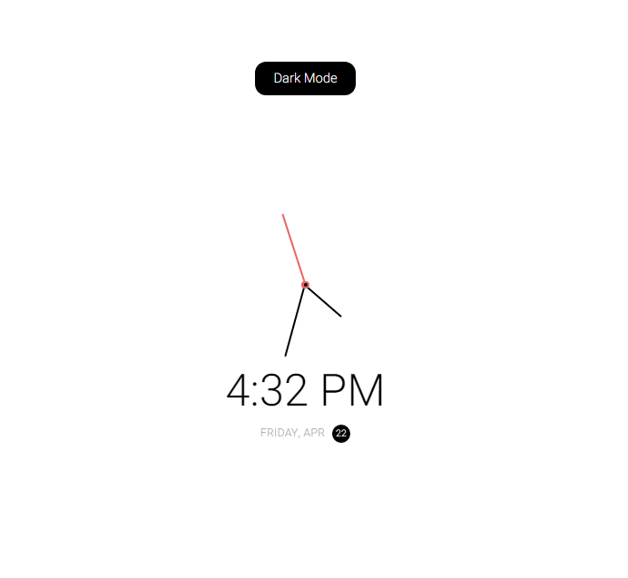

# Theme clock

## Table of contents

- [Overview](#overview)
  - [The challenge](#the-challenge)
  - [Screenshot](#screenshot)
  - [Links](#links)
- [My process](#my-process)
  - [Built with](#built-with)
  - [What I learned](#what-i-learned)
- [Author](#author)

## Overview

### The challenge

Users will be able to:

- View the optimal layout for the app depending on their device's screen size
- See updated Time and Date on screen
- Select "Light Mode" or "dark Mode"

### Screenshot

### Links

- Solution URL: [https://github.com/Naveed89-tech/Theme_clock](https://github.com/Naveed89-tech/Theme_clock)
- Live Site URL: [https://analogcloktheme.netlify.app/](https://analogcloktheme.netlify.app/)

## My process

### Built with

- Semantic HTML5 markup
- Flex-box
- Javascript

### What I learned

During developing this, i have learned how to manipulate the element with Vanilla javascript and how to use variable in CSS correctly.

## Author

- LinkedIn - [Muhammad Naveed](https://www.linkedin.com/in/muhammad-naveed-857600231/)
- Twitter - [@Naveed_Tech_T](https://twitter.com/Naveed_Tech_T)
